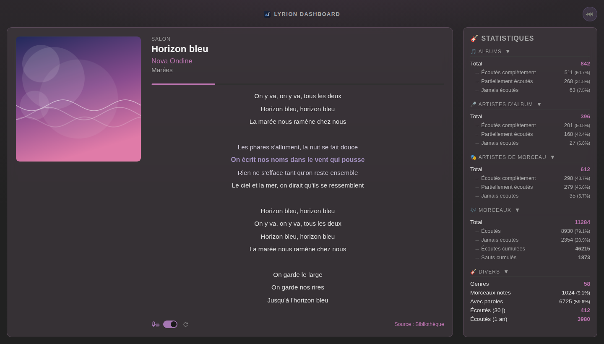
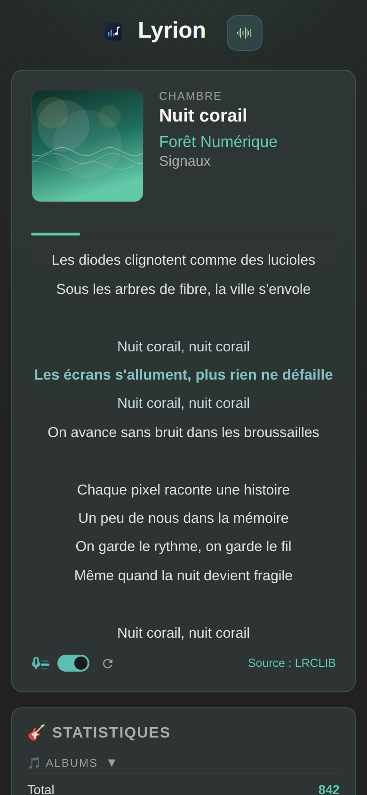
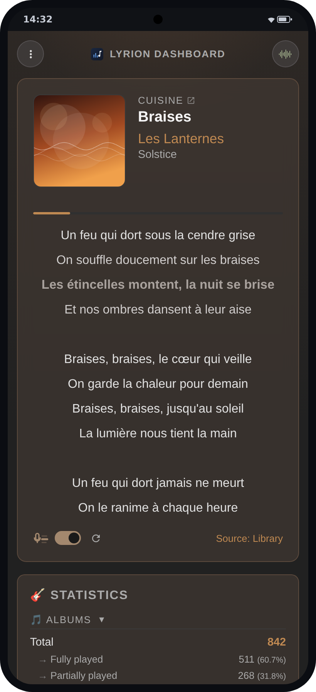

[English](README.md) | [Français](README.fr.md)

# Lyrion Dashboard

Application web Flask pour [Lyrion Music Server](https://github.com/LMS-Community/slimserver) (anciennement Logitech Media Server / Squeezebox Server).

<p>
  
  
  
</p>

## Fonctionnalités

- **Now Playing** -- Détecte automatiquement le lecteur en cours de lecture et affiche sa piste (pochette, titre, artiste, album), rafraîchi via l'API JSON-RPC de Lyrion. La couleur d'accent s'adapte automatiquement à la pochette.
- **Paroles synchronisées** -- Les paroles avec timestamps LRC sont affichées ligne par ligne avec surlignage et défilement automatiques synchronisés à la lecture, façon karaoké. La ligne « Source » est teintée de la couleur d'accent quand les paroles affichées sont synchronisées.
- **Recherche web de paroles** -- Quand la bibliothèque n'a pas de paroles (synchronisées), un interrupteur de synchronisation permet de chercher sur le web (LRCLIB, Musixmatch, Genius) à la demande ou automatiquement pour chaque morceau. En mode auto, un bouton permet de relancer la recherche pour le morceau en cours, en contournant le cache.
- **Statistiques de la bibliothèque** -- Albums, artistes, morceaux joués/non joués, genres, notes, paroles, vélocité d'écoute sur 30 jours.
- **Serveur de fichiers** -- Sert les fichiers depuis un répertoire configurable.
- **Application Android** -- Une fine surcouche WebView (même principe que [lms-material-app](https://github.com/CDrummond/lms-material-app)) avec découverte automatique du serveur LMS, voir [`android/`](android/README.md).

## Structure du projet

```
├── app.py                                 # Point d'entrée Flask (factory)
├── config.py                              # Configuration centralisée (env vars)
├── i18n.py                                # Traductions FR/EN de l'interface
├── requirements.txt                       # Dépendances Python (application web)
├── requirements-cli.txt                   # Dépendances Python (scripts/ uniquement)
├── docker-compose.yml                     # Déploiement via Docker
├── docker-compose.override.yml.example    # Modèle de personnalisation Compose locale
├── .env.example                           # Modèle de configuration
├── routes/
│   ├── nowplaying.py                      # Routes : /, /now-playing.json, /cover, /lyrics.json
│   └── custom.py                          # Route : /files/<path>
├── services/
│   ├── lyrion.py                          # Client JSON-RPC Lyrion
│   ├── database.py                        # Accès SQLite (paroles, stats)
│   ├── lyrics.py                          # Recherche web de paroles (LRCLIB, Musixmatch, Genius)
│   └── tags.py                            # Lecture/écriture des paroles dans les tags audio
├── templates/
│   ├── _icons.html                        # Icônes SVG inline réutilisables (macros Jinja)
│   └── nowplaying.html                    # Dashboard principal
├── static/                                # CSS, JS, icônes
├── scripts/
│   ├── embed_lyrics.py                    # Intègre les paroles web dans les tags des fichiers
│   ├── embed_lyrics_cron.sh               # Wrapper cron : ne retague que les fichiers modifiés
│   └── generate_screenshots.py            # Regénère les captures des README (données factices)
├── android/                               # Application Android (surcouche WebView)
├── tests/
└── docs/screenshots/                      # Captures d'écran du README
```

## Pré-requis

- Python 3.12+
- Un serveur Lyrion Music Server accessible
- Le plugin [Alternative Play Count](https://github.com/AF-1/lms-alternativeplaycount) installé sur Lyrion

## Installation

### Avec Docker (recommandé)

```bash
cp .env.example .env
# Éditer .env avec vos valeurs
docker compose up -d
```

Le déploiement part directement de `python:3.12-slim` et installe les dépendances (versions figées) à chaque démarrage — pas d'image à construire ni à publier, au prix de quelques secondes et d'un accès réseau à chaque redémarrage.

### Personnalisation locale Docker Compose

Pour ajouter des services ou des options locales sans polluer les changements Git, copiez le modèle d'override :

```bash
cp docker-compose.override.yml.example docker-compose.override.yml
# Éditer docker-compose.override.yml selon vos besoins
docker compose up -d
```

Docker Compose charge automatiquement `docker-compose.override.yml` en complément du fichier principal.

### Sans Docker

```bash
pip install -r requirements.txt
cp .env.example .env
# Éditer .env avec vos valeurs
source .env
python app.py
```

L'application est accessible sur `http://localhost:1111`.

## Configuration

| Variable | Description | Défaut |
|---|---|---|
| `LYRION_HOST` | URL du serveur Lyrion (ex: `https://lyrion.local:9000`) | -- |
| `DB_DIR` | Répertoire contenant `library.db` de Lyrion | -- |
| `DB_PERSIST_DIR` | Répertoire contenant `persist.db` de Lyrion | -- |
| `CUSTOM_DATA_DIR` | Répertoire des fichiers générés | `/opt/scripts/custom_data` |
| `HOST` | Adresse d'écoute | `0.0.0.0` |
| `PORT` | Port d'écoute | `1111` |
| `LYRICS_PROVIDERS` | Fournisseurs de paroles web, essayés dans l'ordre (`lrclib`, `musixmatch`, `genius`) | `lrclib,musixmatch,genius` |
| `MUSIXMATCH_TOKEN` | Jeton Musixmatch fixe (sinon récupéré automatiquement) | -- |
| `LRCLIB_TIMEOUT` | Délai d'expiration des requêtes LRCLIB, en secondes | `15` |
| `LYRICS_VERIFY_DURATION_TOLERANCE` | Écart max (secondes) toléré par `--verify` dans `embed_lyrics.py` | `3` |

## Sécurité

Le dashboard n'a **pas d'authentification, par conception** : c'est un
affichage permanent consultable d'un coup d'œil, pensé pour un **LAN
domestique de confiance**. Quiconque peut joindre le port peut voir ce qui
joue en temps réel (information de présence), lire les statistiques de la
bibliothèque et télécharger tout le contenu de `CUSTOM_DATA_DIR`
(`/files/`).

- Ne jamais exposer le port directement sur Internet (pas de redirection de
  port, pas de reverse proxy public).
- Pour l'accès distant, rejoignez le LAN plutôt que d'ouvrir le dashboard :
  un VPN type WireGuard ou Tailscale le garde "LAN only" pendant que vos
  appareils s'y connectent d'où vous voulez.
- La revue complète sécurité & performance est dans la
  [PR #15](https://github.com/werdeil/lyrion-dashboard/pull/15).

## Endpoints

| Méthode | Route | Description |
|---|---|---|
| GET | `/` | Dashboard principal (now playing + stats) |
| GET | `/health` | Vérification de l'état du service |
| GET | `/stats.json` | Statistiques de la bibliothèque (JSON) |
| GET | `/now-playing.json` | État live de la piste du lecteur en cours de lecture, détecté automatiquement (JSON) |
| GET | `/cover/<coverid>.jpg` | Relaie une pochette depuis Lyrion, en same-origin |
| GET | `/cover/remote.jpg` | Relaie la pochette de la piste distante/streamée en cours de lecture |
| GET | `/lyrics.json` | Récupère les paroles d'une piste sur le web, à la demande |
| GET | `/files/<path>` | Sert un fichier depuis le répertoire custom data |

### Widget Homepage

`/stats.json` renvoie du JSON brut, il se branche donc directement sur un widget [`customapi`](https://gethomepage.dev/widgets/services/customapi/) de [Homepage](https://gethomepage.dev) pour afficher les statistiques de la bibliothèque sur votre tableau de bord :

```yaml
- Lyrion Dashboard:
    href: http://lyrion-dashboard:1111
    widget:
      type: customapi
      url: http://lyrion-dashboard:1111/stats.json
      mappings:
        - field: albums_total
          label: Albums
        - field: songs_total
          label: Morceaux
        - field: velocity_30d
          label: Écoutés (30 j)
```

N'importe quelle clé du JSON fonctionne comme `field` — ouvrez `/stats.json` dans un navigateur pour choisir celles qui vous intéressent.

## Scripts

### Intégrer les paroles dans les fichiers (`scripts/embed_lyrics.py`)

Parcourt un dossier (ou des fichiers), récupère les paroles auprès des fournisseurs web et les écrit dans le tag *lyrics* de chaque morceau. Lyrion n'est jamais sollicité : lancez le script quand vous voulez, Lyrion prendra les changements au prochain scan. La configuration (`.env`) est lue automatiquement.

```bash
python scripts/embed_lyrics.py /chemin/vers/musique [options]
# Les jokers shell fonctionnent, même entre guillemets :
python scripts/embed_lyrics.py "/chemin/vers/musique/A*" /chemin/vers/musique/B*
```

| Option | Description |
|---|---|
| `--force` | Réécrit le tag même si des paroles sont déjà présentes. |
| `--clear` | Efface le tag existant quand rien n'est trouvé en ligne, pour refléter ce que proposent les fournisseurs. Traite aussi les fichiers déjà taggés (donc une requête web par fichier) ; combinable avec `--force`. |
| `--dry-run` | Affiche ce qui serait fait, sans rien écrire. |
| `--delay 0.5` | Délai (secondes) entre deux requêtes web (défaut : 0.5). |
| `--verbose` | Journalise chaque fichier, y compris ceux ignorés. |

### Cron : ne re-taguer que les fichiers modifiés (`scripts/embed_lyrics_cron.sh`)

Wrapper destiné au cron : il ne passe à `embed_lyrics.py` que les fichiers dont le `ctime` a changé depuis la dernière passe réussie (`find -cnewer`), via un fichier marqueur.

```bash
scripts/embed_lyrics_cron.sh /chemin/vers/musique [MARQUEUR] [-- OPTIONS]
```

- `MARQUEUR` : fichier d'horodatage (défaut : `state/embed_lyrics.last_run` à la racine du repo). Absent → toute la bibliothèque est traitée (première passe).
- Le marqueur est horodaté au **début** de la passe et n'avance qu'**en cas de succès** : un échec ne fait pas avancer la fenêtre, et un fichier modifié pendant la passe est repris au prochain run. `--dry-run` ne fait pas avancer le marqueur.
- Tout ce qui suit `--` est transmis tel quel à `embed_lyrics.py` (ex. `-- --clear --delay 1`).

```cron
30 3 * * * /chemin/vers/custom_data/scripts/embed_lyrics_cron.sh \
  /chemin/vers/musique >> /tmp/embed_lyrics.log 2>&1
```

> Le `ctime` (et non le `mtime`) est utilisé volontairement : il capte aussi les ré-écritures de tags en place et les fichiers copiés en conservant leur `mtime` (`rsync -a`, `cp -p`).

### Regénérer les captures d'écran des README (`scripts/generate_screenshots.py`)

Lance la vraie application avec les couches Lyrion/base de données mockées (piste factice en cours de lecture, paroles LRC synchronisées, pochettes générées, statistiques fixes) et capture les images des README avec Chromium headless : le desktop dans les deux langues, la vue mobile responsive et la vue application Android dans un cadre de téléphone. Chaque capture utilise volontairement une pochette différente, pour montrer l'adaptation de la couleur d'accent à la pochette. Aucun serveur Lyrion ni base de données n'est nécessaire.

```bash
pip install -r requirements.txt playwright
playwright install chromium   # une seule fois
python scripts/generate_screenshots.py
```

## Licence

Ce projet est distribué sous licence MIT — voir le fichier [LICENSE](LICENSE).
