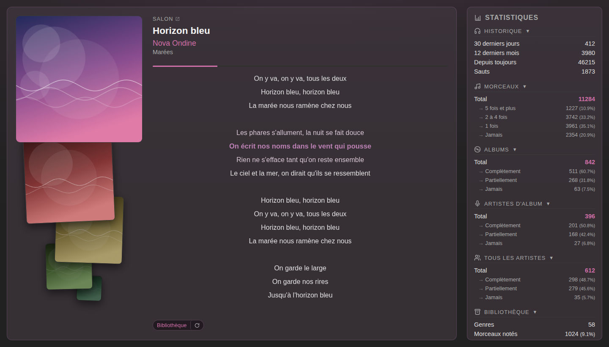
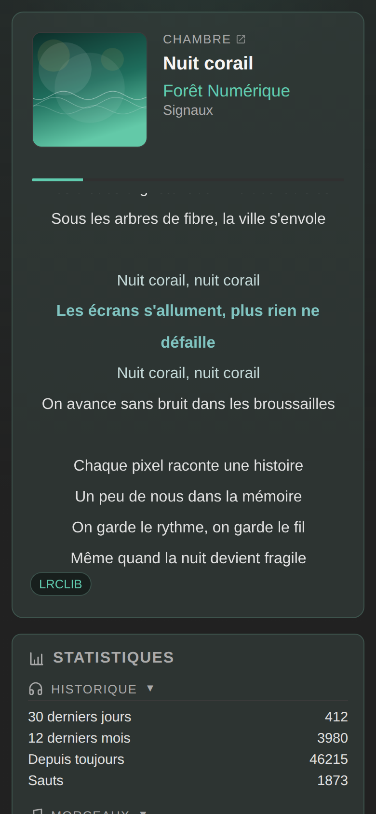
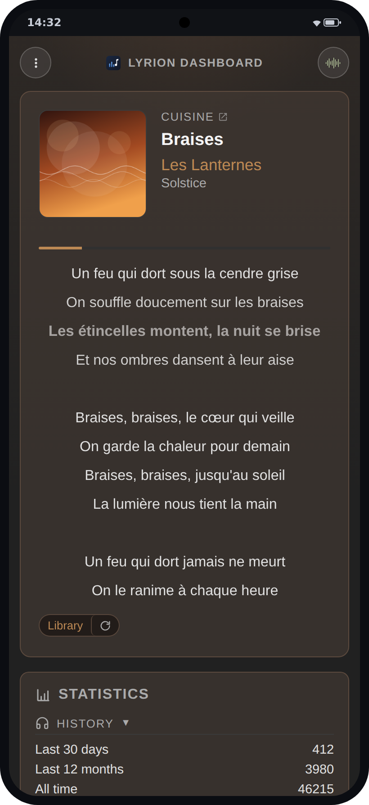

[English](README.md) | [Français](README.fr.md)

# Lyrion Dashboard

Application web Flask pour [Lyrion Music Server](https://github.com/LMS-Community/slimserver) (anciennement Logitech Media Server / Squeezebox Server).

<p>
  
  
  
</p>

## Fonctionnalités

- **Now Playing** -- Détecte automatiquement le lecteur en cours de lecture et affiche sa piste (pochette, titre, artiste, album), rafraîchi via l'API JSON-RPC de Lyrion. La couleur d'accent s'adapte automatiquement à la pochette. Un clic sur la pochette l'agrandit jusqu'à remplir la carte de lecture, la progression de lecture courant sur son arête basse — les statistiques restent lisibles à côté ; un clic n'importe où ou Échap la ramène à sa taille.
- **Dernières écoutes** -- Sur grand écran, les albums récemment écoutés s'empilent comme des pochettes de disque sous la cover — le plus récent au-dessus, les plus anciens qui descendent en cascade, plus petits et plus sombres, pour que l'ordre se lise d'un coup d'œil. Survoler une pochette la met au premier plan. Construit à partir de l'historique Alternative Play Count, une pochette par album, sauts exclus.
- **Paroles synchronisées** -- Les paroles avec timestamps LRC sont affichées ligne par ligne avec surlignage et défilement automatiques synchronisés à la lecture, façon karaoké. La ligne « Source » est teintée de la couleur d'accent quand les paroles affichées sont synchronisées.
- **Recherche web de paroles** -- Un interrupteur de recherche automatique interroge le web (LRCLIB, Musixmatch, Genius) pour chaque morceau joué : il complète les paroles absentes de la bibliothèque et convertit son texte simple en version synchronisée (karaoké) lorsqu'il en trouve une. Tant qu'il est activé, un bouton permet de relancer la recherche pour le morceau en cours, en contournant le cache ; il se grise quelques secondes entre deux recherches sur le même morceau.
- **Statistiques de la bibliothèque** -- Albums, artistes, morceaux joués/non joués, genres, notes, paroles, vélocité d'écoute sur 30 jours.
- **Serveur de fichiers** -- Sert les fichiers depuis un répertoire configurable.
- **Application Android** -- Une fine surcouche WebView (même principe que [lms-material-app](https://github.com/CDrummond/lms-material-app)) avec découverte automatique du serveur LMS, publiée sur [F-Droid](https://f-droid.org/packages/com.werdeil.lyriondashboard/), voir [`android/`](android/README.md).

## Structure du projet

```
├── app.py                                 # Point d'entrée Flask (factory)
├── config.py                              # Configuration centralisée (env vars)
├── i18n.py                                # Traductions FR/EN de l'interface
├── logsetup.py                            # Format et niveau des logs (LOG_LEVEL)
├── requirements.txt                       # Dépendances Python (application web)
├── requirements-cli.txt                   # Dépendances Python (scripts/ uniquement)
├── docker-compose.yml                     # Déploiement via Docker
├── docker-compose.override.yml.example    # Modèle de personnalisation Compose locale
├── .env.example                           # Modèle de configuration
├── routes/
│   ├── nowplaying.py                      # Routes : /, /now-playing.json, /cover, /lyrics.json
│   └── custom.py                          # Route : /files/<path>
├── services/
│   ├── lyrion.py                          # Client JSON-RPC Lyrion
│   ├── artwork.py                         # Lit la taille d'une image dans son en-tête
│   ├── database.py                        # Accès SQLite (paroles, stats)
│   ├── lyrics.py                          # Recherche web de paroles (LRCLIB, Musixmatch, Genius)
│   └── tags.py                            # Lecture/écriture des paroles et pochettes dans les tags audio
├── templates/
│   ├── _icons.html                        # Icônes SVG inline réutilisables (macros Jinja)
│   └── nowplaying.html                    # Dashboard principal
├── static/                                # CSS, JS, icônes
├── scripts/
│   ├── embed_lyrics.py                    # Intègre les paroles web dans les tags des fichiers
│   ├── embed_lyrics_cron.sh               # Wrapper cron : ne retague que les fichiers modifiés
│   ├── embed_covers.py                    # Intègre folder.jpg dans les tags des fichiers
│   ├── embed_covers_cron.sh               # Wrapper cron : ne revérifie que les dossiers modifiés
│   └── generate_screenshots.py            # Regénère les captures des README (données factices)
├── android/                               # Application Android (surcouche WebView)
├── tests/
└── docs/screenshots/                      # Captures d'écran du README
```

## Pré-requis

- Python 3.12+
- Un serveur Lyrion Music Server accessible
- Le plugin [Alternative Play Count](https://github.com/AF-1/lms-alternativeplaycount) installé sur Lyrion

## Installation

### Avec Docker (recommandé)

```bash
cp .env.example .env
# Éditer .env avec vos valeurs
docker compose up -d
```

Le déploiement part directement de `python:3.12-slim` et installe les dépendances (versions figées) à chaque démarrage — pas d'image à construire ni à publier, au prix de quelques secondes et d'un accès réseau à chaque redémarrage.

### Personnalisation locale Docker Compose

Pour ajouter des services ou des options locales sans polluer les changements Git, copiez le modèle d'override :

```bash
cp docker-compose.override.yml.example docker-compose.override.yml
# Éditer docker-compose.override.yml selon vos besoins
docker compose up -d
```

Docker Compose charge automatiquement `docker-compose.override.yml` en complément du fichier principal.

### Sans Docker

```bash
pip install -r requirements.txt
cp .env.example .env
# Éditer .env avec vos valeurs
source .env
python app.py
```

L'application est accessible sur `http://localhost:1111`.

### Application Android

L'application compagnon est publiée sur F-Droid :

[](https://f-droid.org/packages/com.werdeil.lyriondashboard/)

Un APK signé est aussi attaché à chaque [release GitHub](https://github.com/werdeil/lyrion-dashboard/releases). Au premier lancement, laissez-la découvrir le serveur Lyrion sur le réseau local ou saisissez vous-même l'URL du dashboard — voir [`android/`](android/README.md).

## Configuration

| Variable | Description | Défaut |
|---|---|---|
| `LYRION_HOST` | URL du serveur Lyrion (ex: `https://lyrion.local:9000`) | -- |
| `DB_DIR` | Répertoire contenant `library.db` de Lyrion | -- |
| `DB_PERSIST_DIR` | Répertoire contenant `persist.db` de Lyrion | -- |
| `CUSTOM_DATA_DIR` | Répertoire des fichiers générés | `/opt/scripts/custom_data` |
| `LYRICS_PROVIDERS` | Fournisseurs de paroles web, essayés dans l'ordre (`lrclib`, `musixmatch`, `genius`) | `lrclib,musixmatch,genius` |
| `MUSIXMATCH_TOKEN` | Jeton Musixmatch fixe (sinon récupéré automatiquement) | -- |
| `LRCLIB_TIMEOUT` | Délai d'expiration des requêtes LRCLIB, en secondes | `15` |
| `LYRICS_VERIFY_DURATION_TOLERANCE` | Écart max (secondes) toléré par `--verify` dans `embed_lyrics.py` | `3` |
| `TZ` | Fuseau horaire utilisé pour aligner les fenêtres d'écoutes récentes sur minuit local (ex: `Europe/Paris`) | `UTC` |
| `LOG_LEVEL` | Verbosité des logs applicatifs (`DEBUG`, `INFO`, `WARNING`, `ERROR`, `CRITICAL`) | `INFO` (`DEBUG` si `DEV=1`) |
| `DEV` | Mettre à `1` pour recharger les templates à la volée et désactiver le cache statique (développement) | -- |

## Logs

Tout ce que l'application a à dire part sur la sortie standard du conteneur :

```bash
docker logs -f lyrion-dashboard
```

Au démarrage, elle indique la version, le `LYRION_HOST` résolu, l'ordre des fournisseurs de paroles et si `library.db` / `persist.db` ont bien été trouvés — la première chose à vérifier quand la page reste vide.

En `INFO` (le défaut), une piste qui finit sans paroles raconte toute son histoire : la consultation de la bibliothèque, puis chaque fournisseur, puis le verdict.

```
track 12345: no lyrics in the library
lyrics: lrclib has no match (312 ms)
lyrics: musixmatch unreachable after 5003 ms (Read timed out)
lyrics: genius has no match (486 ms)
lyrics: 'Hocus Pocus' by 'Focus' -> none (synced=False, plain=False) in 5801 ms
```

Une recherche qui aboutit tient en une ligne, `lyrics: 'Space Debris' by 'Deep Purple' -> lrclib (synced=True, plain=True) in 412 ms`. `source` distingue les cas : un nom de fournisseur (trouvé), `none` (recherche faite, aucune correspondance), `rejected` (un candidat est revenu mais correspondait à un autre enregistrement), `unavailable` (aucun fournisseur n'a répondu — la recherche n'est pas mise en cache et sera réessayée). Également en `INFO` : un résultat servi depuis le cache au lieu d'une nouvelle recherche, une recherche refusée par le rate limit ou le cooldown de rafraîchissement, et un recalcul des statistiques avec sa durée.

Avec `LOG_LEVEL=DEBUG` (puis un redémarrage du conteneur), s'ajoutent le détail HTTP de chaque fournisseur, les consultations qui ont abouti, l'énumération des lecteurs et chaque appel JSON-RPC à Lyrion avec sa durée. C'est verbeux — le sondage now-playing tourne toutes les 2 s — donc à activer le temps de reproduire un problème, puis à remettre comme avant.

## Sécurité

Le dashboard n'a **pas d'authentification, par conception** : c'est un affichage permanent consultable d'un coup d'œil, pensé pour un **LAN domestique de confiance**. Quiconque peut joindre le port peut voir ce qui joue en temps réel (information de présence), lire les statistiques de la bibliothèque et télécharger tout le contenu de `CUSTOM_DATA_DIR` (`/files/`).

- Ne jamais exposer le port directement sur Internet (pas de redirection de port, pas de reverse proxy public).
- Pour l'accès distant, rejoignez le LAN plutôt que d'ouvrir le dashboard : un VPN type WireGuard ou Tailscale le garde "LAN only" pendant que vos appareils s'y connectent d'où vous voulez.
- La revue complète sécurité & performance est dans la [PR #15](https://github.com/werdeil/lyrion-dashboard/pull/15).

## Endpoints

| Méthode | Route | Description |
|---|---|---|
| GET | `/` | Dashboard principal (now playing + stats) |
| GET | `/health` | Vérification de l'état du service |
| GET | `/stats.json` | Statistiques de la bibliothèque (JSON) |
| GET | `/now-playing.json` | État live de la piste du lecteur en cours de lecture, détecté automatiquement (JSON) |
| GET | `/cover/<coverid>.jpg` | Relaie une pochette depuis Lyrion, en same-origin |
| GET | `/cover/remote.jpg` | Relaie la pochette de la piste distante/streamée en cours de lecture |
| GET | `/mosaic-covers.json` | Ids de pochettes pour la mosaïque de l'état vide, les plus récemment écoutés d'abord (JSON) |
| GET | `/recent-covers.json` | Ids de pochettes des albums récemment écoutés, du plus récent au plus ancien (JSON) |
| GET | `/lyrics.json` | Récupère les paroles d'une piste sur le web, à la demande |
| GET | `/files/<path>` | Sert un fichier depuis le répertoire custom data |

### Widget Homepage

`/stats.json` renvoie du JSON brut, il se branche donc directement sur un widget [`customapi`](https://gethomepage.dev/widgets/services/customapi/) de [Homepage](https://gethomepage.dev) pour afficher les statistiques de la bibliothèque sur votre tableau de bord :

```yaml
- Lyrion Dashboard:
    href: http://lyrion-dashboard:1111
    widget:
      type: customapi
      url: http://lyrion-dashboard:1111/stats.json
      mappings:
        - field: albums_total
          label: Albums
        - field: songs_total
          label: Morceaux
        - field: velocity_30d
          label: Écoutés (30 j)
```

N'importe quelle clé du JSON fonctionne comme `field` — ouvrez `/stats.json` dans un navigateur pour choisir celles qui vous intéressent.

## Scripts

### Intégrer les paroles dans les fichiers (`scripts/embed_lyrics.py`)

Parcourt un dossier (ou des fichiers), récupère les paroles auprès des fournisseurs web et les écrit dans le tag *lyrics* de chaque morceau. Lyrion n'est jamais sollicité : lancez le script quand vous voulez, Lyrion prendra les changements au prochain scan. La configuration (`.env`) est lue automatiquement.

```bash
python scripts/embed_lyrics.py /chemin/vers/musique [options]
# Les jokers shell fonctionnent, même entre guillemets :
python scripts/embed_lyrics.py "/chemin/vers/musique/A*" /chemin/vers/musique/B*
```

| Option | Description |
|---|---|
| <code>&#8209;&#8209;force</code> | Réécrit le tag même si des paroles sont déjà présentes. |
| <code>&#8209;&#8209;clear</code> | Efface le tag existant quand rien n'est trouvé en ligne, pour refléter ce que proposent les fournisseurs. Traite aussi les fichiers déjà taggés (donc une requête web par fichier) ; combinable avec `--force`. |
| <code>&#8209;&#8209;no&#8209;verify</code> | Accepte les paroles d'un fournisseur même quand son titre/artiste/durée ne correspondent pas au fichier. Désactivé par défaut : les tags étant écrits définitivement, un mauvais résultat est pire que l'absence de paroles. |
| <code>&#8209;&#8209;dry&#8209;run</code> | Affiche ce qui serait fait, sans rien écrire. |
| <code>&#8209;&#8209;delay&nbsp;0.5</code> | Délai (secondes) entre deux requêtes web (défaut : 0.5). |
| <code>&#8209;&#8209;verbose</code> | Journalise chaque fichier, y compris ceux ignorés. |

### Cron : ne re-taguer que les fichiers modifiés (`scripts/embed_lyrics_cron.sh`)

Wrapper destiné au cron : il ne passe à `embed_lyrics.py` que les fichiers dont le `ctime` a changé depuis la dernière passe réussie (`find -cnewer`), via un fichier marqueur.

```bash
scripts/embed_lyrics_cron.sh /chemin/vers/musique [MARQUEUR] [-- OPTIONS]
```

- `MARQUEUR` : fichier d'horodatage (défaut : `state/embed_lyrics.last_run` à la racine du repo). Absent → toute la bibliothèque est traitée (première passe).
- Le marqueur est horodaté au **début** de la passe et n'avance qu'**en cas de succès** : un échec ne fait pas avancer la fenêtre, et un fichier modifié pendant la passe est repris au prochain run. `--dry-run` ne fait pas avancer le marqueur.
- Tout ce qui suit `--` est transmis tel quel à `embed_lyrics.py` (ex. `-- --clear --delay 1`).

```cron
30 3 * * * /chemin/vers/custom_data/scripts/embed_lyrics_cron.sh \
  /chemin/vers/musique >> /tmp/embed_lyrics.log 2>&1
```

> Le `ctime` (et non le `mtime`) est utilisé volontairement : il capte aussi les ré-écritures de tags en place et les fichiers copiés en conservant leur `mtime` (`rsync -a`, `cp -p`).

### Intégrer les pochettes dans les fichiers (`scripts/embed_covers.py`)

Parcourt les dossiers d'albums et écrit le fichier de pochette de chaque dossier dans le tag *artwork* de ses morceaux, partout où ce fichier est plus net que ce que portent déjà les tags. Lyrion affiche la pochette embarquée et ignore totalement `folder.jpg` : un album avec une pochette de 1500 px sur le disque et une de 300 px dans ses tags continue donc d'afficher la petite tant que ce script n'est pas passé. Lyrion n'est jamais sollicité : il prendra le changement à son prochain scan.

```bash
python scripts/embed_covers.py /chemin/vers/musique [options]
# Les jokers shell fonctionnent, même entre guillemets :
python scripts/embed_covers.py "/chemin/vers/musique/A*" /chemin/vers/musique/B*
```

| Option | Description |
|---|---|
| <code>&#8209;&#8209;name&nbsp;folder.jpg</code> | Nom du fichier de pochette cherché dans chaque dossier d'album (défaut : `folder.jpg`), casse indifférente. |
| <code>&#8209;&#8209;dry&#8209;run</code> | Affiche quels albums seraient re-tagués, sans rien écrire. |
| <code>&#8209;&#8209;verbose</code> | Journalise chaque album, y compris ceux ignorés. |

Les pochettes sont comparées sur leur **petit côté**, celui qui décide de la netteté à l'écran : seul un fichier plus grand est intégré, et un album dont les tags ne portent aucune pochette est toujours complété. L'image est stockée telle quelle, jamais ré-encodée. L'intégration réécrit chaque morceau de l'album, aussi la passe indique-t-elle de combien grossissent les fichiers audio — une pochette de 2 Mo sur un album de douze titres ajoute 24 Mo, qu'il faudra ensuite resynchroniser et sauvegarder.

### Cron : ne re-vérifier que les dossiers modifiés (`scripts/embed_covers_cron.sh`)

Même mécanisme de marqueur que le wrapper des paroles, à ceci près que l'unité est le dossier d'album : `find -cnewer` liste les fichiers dont le `ctime` a changé, et ce sont leurs dossiers qui sont passés à `embed_covers.py`. Un `folder.jpg` remplacé met donc son album dans la file au même titre qu'un nouveau morceau.

```bash
scripts/embed_covers_cron.sh /chemin/vers/musique [MARQUEUR] [-- OPTIONS]
```

- `MARQUEUR` : fichier d'horodatage (défaut : `state/embed_covers.last_run` à la racine du repo). Absent → toute la bibliothèque est traitée (première passe).
- Mêmes règles que ci-dessus : horodaté au **début** de la passe, avancé uniquement **en cas de succès**, laissé en place par `--dry-run`.
- Tout ce qui suit `--` est transmis tel quel à `embed_covers.py` (ex. `-- --name cover.jpg`).

```cron
0 5 * * * /chemin/vers/repo/scripts/embed_covers_cron.sh \
  /chemin/vers/musique >> /tmp/embed_covers.log 2>&1
```

> Intégrer une pochette modifie le `ctime` de chaque morceau : l'album reparaît donc à la passe suivante, qui trouve alors les tags déjà corrects et passe son chemin.

### Regénérer les captures d'écran des README (`scripts/generate_screenshots.py`)

Lance la vraie application avec les couches Lyrion/base de données mockées (piste factice en cours de lecture, paroles LRC synchronisées, pochettes générées, historique d'écoutes factice, statistiques fixes) et capture les images des README avec Chromium headless : le desktop dans les deux langues (avec la pile des dernières écoutes sous la cover), la vue mobile responsive et la vue application Android dans un cadre de téléphone. Chaque capture utilise volontairement une pochette différente, pour montrer l'adaptation de la couleur d'accent à la pochette. Aucun serveur Lyrion ni base de données n'est nécessaire.

```bash
pip install -r requirements.txt playwright
playwright install chromium   # une seule fois
python scripts/generate_screenshots.py
```

## Sponsor

Si ce tableau de bord vous est utile, vous pouvez soutenir son développement via [GitHub Sponsors](https://github.com/sponsors/werdeil). C'est entièrement facultatif : le projet reste gratuit et sous licence MIT dans tous les cas.

## Licence

Ce projet est distribué sous licence MIT — voir le fichier [LICENSE](LICENSE).
