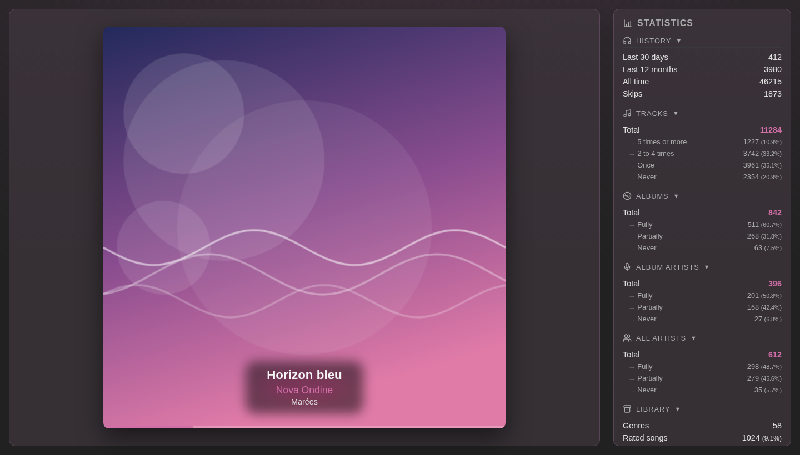
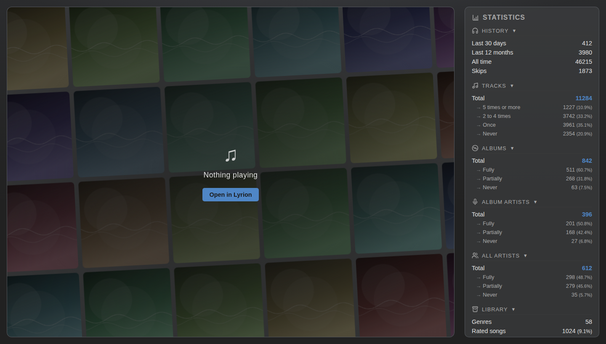
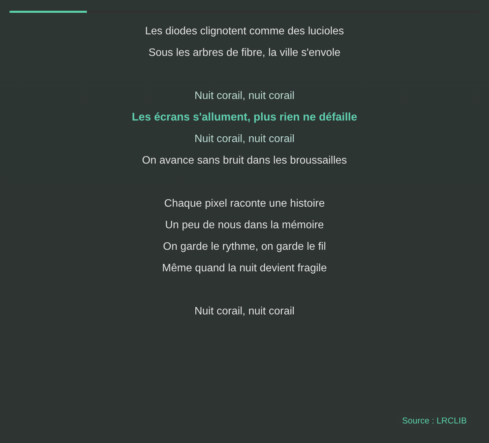
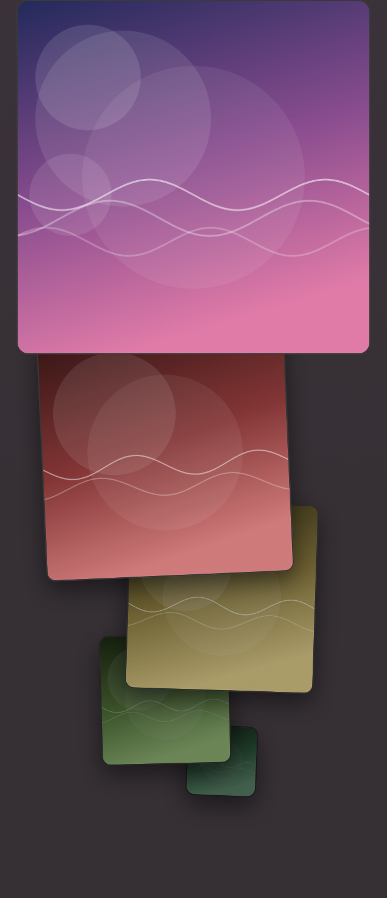
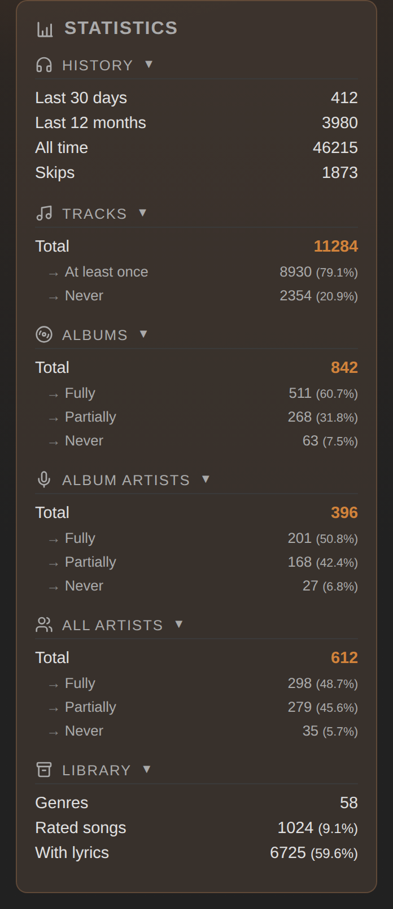

<p align="center"><a href="README.md">English</a> | <a href="README.fr.md">Français</a></p>

<p align="center"></p>

<h1 align="center">Lyrion Dashboard</h1>

<p align="center">Application web Flask pour <a href="https://github.com/LMS-Community/slimserver">Lyrion Music Server</a> (anciennement Logitech Media Server / Squeezebox Server) : une page « en cours de lecture » consultable d'un coup d'œil, avec paroles synchronisées, dernières écoutes et statistiques de la bibliothèque, dans un navigateur ou via son <a href="https://f-droid.org/packages/com.werdeil.lyriondashboard/">application Android</a> compagnon.</p>

<p align="center">
  
  
</p>

## Fonctionnalités

- **Now Playing** -- Le lecteur en cours de lecture est détecté automatiquement et sa piste affichée en direct (pochette, titre, artiste, album), la couleur d'accent étant échantillonnée sur la pochette. Un clic sur la pochette l'agrandit jusqu'à remplir la carte.
- **Dernières écoutes** -- Sur grand écran, les albums récemment écoutés s'empilent comme des pochettes de disque sous la cover, le plus récent au-dessus. Construit à partir de l'historique d'écoute, une pochette par album ; avec le plugin Alternative Play Count installé, les sauts sont exclus.
- **Paroles synchronisées** -- Les paroles avec timestamps LRC défilent ligne par ligne au rythme de la lecture, façon karaoké.
- **Recherche web de paroles** -- Un interrupteur de recherche automatique interroge LRCLIB, Musixmatch et Genius pour chaque morceau joué : il complète les paroles absentes de la bibliothèque et convertit son texte simple en version synchronisée quand elle existe.
- **Statistiques de la bibliothèque** -- Albums, artistes, morceaux joués/non joués, genres, notes, paroles, vélocité d'écoute sur 30 jours.
- **Serveur de fichiers** -- Sert les fichiers depuis un répertoire configurable.
- **Application Android** -- Une fine surcouche WebView (même principe que [lms-material-app](https://github.com/CDrummond/lms-material-app)) avec découverte automatique du serveur LMS, publiée sur [F-Droid](https://f-droid.org/packages/com.werdeil.lyriondashboard/), voir [`android/`](android/README.md) (en anglais).

## Démo

<p>
  <a href="docs/screenshots/demo-cover-zoom.png"></a>
  <a href="docs/screenshots/demo-empty.png"></a>
  <a href="docs/screenshots/demo-lyrics.png"></a>
  <a href="docs/screenshots/dashboard-mobile.png"></a>
  <a href="docs/screenshots/demo-recent.png"></a>
  <a href="docs/screenshots/demo-stats.png"></a>
</p>

De gauche à droite, cliquez pour la version pleine taille : la pochette agrandie, la mosaïque des albums récemment écoutés de l'état vide, les paroles karaoké, la vue mobile, la pile des dernières écoutes et le panneau de statistiques.

## Prérequis

- Python 3.12+
- Un serveur Lyrion Music Server accessible
- Conseillé : le plugin [Alternative Play Count](https://github.com/AF-1/lms-alternativeplaycount) sur Lyrion. Sans lui, le tableau de bord lit les compteurs d'écoute de Lyrion : le nombre de sauts disparaît des statistiques et, comme Lyrion met aussi à jour la date de dernière écoute sur un saut, un album seulement zappé peut apparaître dans les dernières écoutes.

## Installation

### Avec Docker (recommandé)

Récupérez [`docker-compose.yml`](docker-compose.yml) et [`.env.example`](.env.example), puis :

```bash
cp .env.example .env
# Éditer .env avec vos valeurs
docker compose up -d
```

Cela tire `ghcr.io/werdeil/lyrion-dashboard:latest`, construite pour amd64 et arm64 à chaque release. Épingler une version, mettre à jour ou construire depuis les sources : tout est sur la page [Docker](docs/docker.fr.md).

### Sans Docker

```bash
pip install -r requirements.txt
cp .env.example .env
# Éditer .env avec vos valeurs
source .env
python app.py
```

L'application est accessible sur `http://localhost:1111`.

### Application Android

L'application compagnon est publiée sur F-Droid :

[](https://f-droid.org/packages/com.werdeil.lyriondashboard/)

Un APK signé est aussi attaché à chaque [release GitHub](https://github.com/werdeil/lyrion-dashboard/releases). Au premier lancement, laissez-la découvrir le serveur Lyrion sur le réseau local ou saisissez vous-même l'URL du dashboard — voir [`android/`](android/README.md) (en anglais).

## Documentation

- [Configuration](docs/configuration.fr.md) — variables d'environnement.
- [Docker](docs/docker.fr.md) — tags d'image, mise à jour, construction depuis les sources, personnalisation Compose locale.
- [Logs](docs/logs.fr.md) — ce que l'application écrit à chaque niveau, et comment lire une recherche de paroles restée vide.
- [Endpoints](docs/endpoints.fr.md) — les routes HTTP, et le widget Homepage alimenté par `/stats.json`.
- [Scripts](docs/scripts.fr.md) — intégration des paroles et des pochettes dans les tags, wrappers cron, régénération de ces captures.
- [Application Android](android/README.md) — la surcouche WebView : installation, build, découverte (en anglais).

## Sécurité

Le dashboard n'a **pas d'authentification, par conception** : c'est un affichage permanent consultable d'un coup d'œil, pensé pour un **LAN domestique de confiance**. Quiconque peut joindre le port peut voir ce qui joue en temps réel (information de présence), lire les statistiques de la bibliothèque et télécharger tout le contenu de `CUSTOM_DATA_DIR` (`/files/`).

- Ne jamais exposer le port directement sur Internet (pas de redirection de port, pas de reverse proxy public).
- Pour l'accès distant, rejoignez le LAN plutôt que d'ouvrir le dashboard : un VPN type WireGuard ou Tailscale le garde "LAN only" pendant que vos appareils s'y connectent d'où vous voulez.

## Sponsor

Si ce tableau de bord vous est utile, vous pouvez soutenir son développement via [GitHub Sponsors](https://github.com/sponsors/werdeil). C'est entièrement facultatif : le projet reste gratuit et sous licence MIT dans tous les cas.

## Licence

Ce projet est distribué sous licence MIT — voir le fichier [LICENSE](LICENSE).
