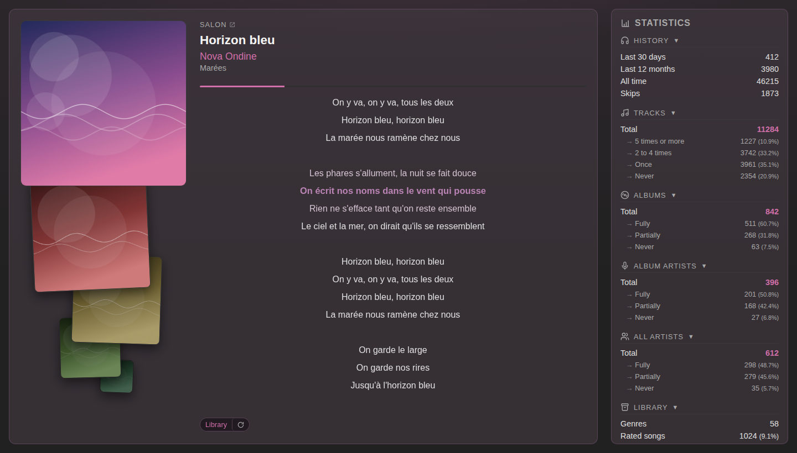

[English](README.md) | [Français](README.fr.md)


# Lyrion Dashboard

A Flask web app for [Lyrion Music Server](https://github.com/LMS-Community/slimserver) (formerly Logitech Media Server / Squeezebox Server): a glanceable "now playing" page with synced lyrics, recent plays and library statistics, in a browser or through its companion [Android app](https://f-droid.org/packages/com.werdeil.lyriondashboard/).

<p>
  
  
</p>

## Features

- **Now Playing** -- The player currently playing is detected automatically and its track shown live (cover art, title, artist, album), with the accent color sampled from the cover. Clicking the cover grows it over the panel.
- **Recent plays** -- On wide screens the recently played albums stack up as a pile of sleeves under the cover, newest on top. Built from the Alternative Play Count history, one cover per album, skips excluded.
- **Synced lyrics** -- Lyrics with LRC timestamps scroll line by line in time with playback, karaoke-style.
- **Web lyrics fallback** -- An auto-search switch queries LRCLIB, Musixmatch and Genius for every playing track: it fills in what the library is missing and upgrades plain text to a synced version when one exists.
- **Library statistics** -- Albums, artists, played/unplayed tracks, genres, ratings, lyrics, 30-day listening velocity.
- **File server** -- Serves files from a configurable directory.
- **Android app** -- A thin WebView wrapper (same principle as [lms-material-app](https://github.com/CDrummond/lms-material-app)) with LMS auto-discovery, published on [F-Droid](https://f-droid.org/packages/com.werdeil.lyriondashboard/), see [`android/`](android/README.md).

## Demo

<p>
  <a href="docs/screenshots/demo-cover-zoom.png"></a>
  <a href="docs/screenshots/demo-empty.png"></a>
  <a href="docs/screenshots/demo-lyrics.png"></a>
  <a href="docs/screenshots/dashboard-mobile.png"></a>
  <a href="docs/screenshots/demo-recent.png"></a>
  <a href="docs/screenshots/demo-stats.png"></a>
</p>

Left to right, click any of them for the full-size image: the enlarged cover, the empty state's mosaic of recently played albums, the karaoke lyrics, the mobile layout, the pile of recent sleeves and the statistics panel.

## Requirements

- Python 3.12+
- An accessible Lyrion Music Server
- The [Alternative Play Count](https://github.com/AF-1/lms-alternativeplaycount) plugin installed on Lyrion

## Installation

### With Docker (recommended)

```bash
cp .env.example .env
# Edit .env with your values
docker compose up -d
```

This deploys straight from `python:3.12-slim` and installs pinned dependencies on each start — no custom image to build or publish, at the cost of a few seconds and network access on every restart.

### Without Docker

```bash
pip install -r requirements.txt
cp .env.example .env
# Edit .env with your values
source .env
python app.py
```

The app is available at `http://localhost:1111`.

### Android app

The companion app is published on F-Droid:

[](https://f-droid.org/packages/com.werdeil.lyriondashboard/)

A signed APK is also attached to each [GitHub release](https://github.com/werdeil/lyrion-dashboard/releases). On first launch, let it discover the Lyrion server on the local network or enter the dashboard URL yourself — see [`android/`](android/README.md).

## Documentation

- [Configuration](docs/configuration.md) — environment variables and local Compose customization.
- [Logs](docs/logs.md) — what the app prints at each level, and how to read a lyrics search that found nothing.
- [Endpoints](docs/endpoints.md) — the HTTP routes, and the Homepage widget fed by `/stats.json`.
- [Scripts](docs/scripts.md) — embedding lyrics and cover art into audio file tags, their cron wrappers, and regenerating these screenshots.
- [Android app](android/README.md) — the WebView wrapper: install, build, discovery.

## Security

The dashboard has **no authentication, by design**: it is a glanceable, always-on display meant for a **trusted home LAN**. Anyone who can reach the port can see what is playing in real time (presence information), read the library statistics and download everything under `CUSTOM_DATA_DIR` (`/files/`).

- Never expose the port directly to the Internet (no port forwarding, no public reverse proxy).
- For remote access, join the LAN instead of opening the dashboard up: a VPN such as WireGuard or Tailscale keeps it LAN-only while your devices connect from anywhere.

## Sponsor

If this dashboard is useful to you, you can support its development through [GitHub Sponsors](https://github.com/sponsors/werdeil). It is entirely optional: the project stays free and MIT-licensed either way.

## License

This project is distributed under the MIT license — see the [LICENSE](LICENSE) file.
