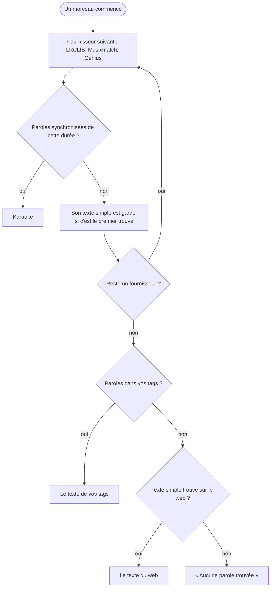

[English](lyrics.md) | [Français](lyrics.fr.md) — retour au [README](../README.fr.md)

# Paroles

Les paroles de vos tags s'affichent dès le début du morceau, et une recherche web part quand même pour chaque morceau : c'est ainsi qu'un texte simple passe en karaoké. Les fournisseurs sont interrogés dans l'ordre de `LYRICS_PROVIDERS` ([Configuration](configuration.fr.md)), et une version synchronisée ne compte que si sa durée correspond à celle du morceau à 3 secondes près : un LRC fait pour une version live ou longue défilerait sur la mauvaise chronologie.

Genius n'a que du texte simple : il est sauté dès qu'un texte est gardé. Chaque version trouvée reste accessible d'un appui sur la ligne de provenance sous les paroles, qui permet aussi de les masquer pour le morceau. Le bouton de relance refait la recherche sans passer par le cache du serveur, où un résultat trouvé reste 24 heures et une absence 1 heure. Pour savoir pourquoi un morceau est resté sans paroles, lisez sa recherche dans les [logs](logs.fr.md).
