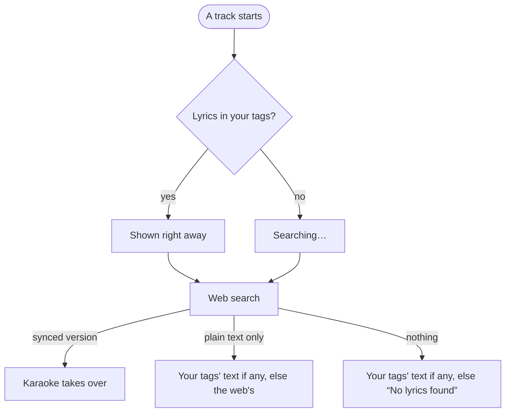
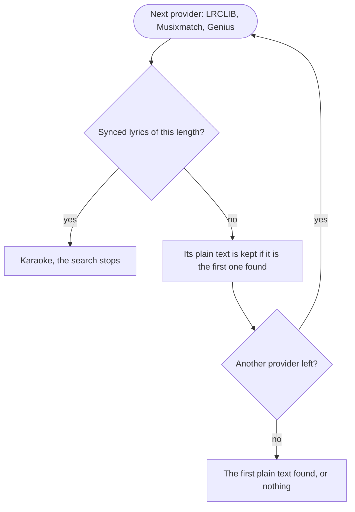

[English](lyrics.md) | [Français](lyrics.fr.md) — back to the [README](../README.md)

# Lyrics

## What the page shows

The lyrics in your tags are shown as soon as a track starts, and a web search runs for every track all the same: it is how a plain text gets upgraded to karaoke.

Every version found stays one tap away on the source line under the lyrics, which also hides them for the track. The retry button runs the search again, bypassing the server's cache.

## How the web search picks a version

Providers are asked in the `LYRICS_PROVIDERS` order ([Configuration](configuration.md)). A synced version only counts when its length matches the track's within 3 seconds: an LRC made for a live or extended take would scroll against the wrong timeline.

Genius only has plain text, so it is skipped once one is kept. A found result is cached for 24 hours, a miss for 1 hour. To see why a track ended up without lyrics, read its search in the [logs](logs.md).
